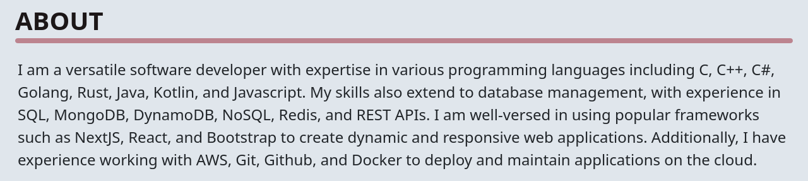
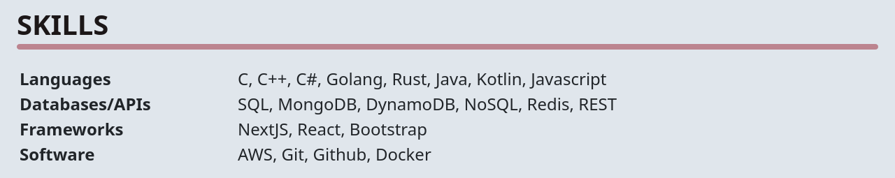
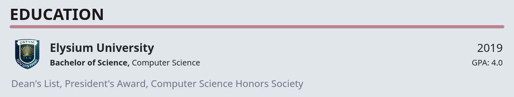
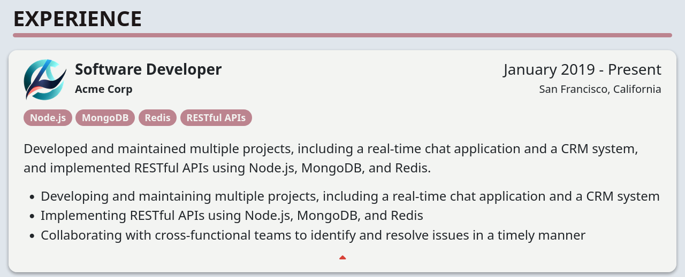
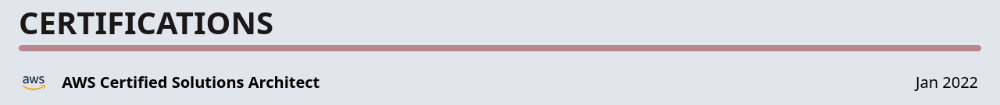
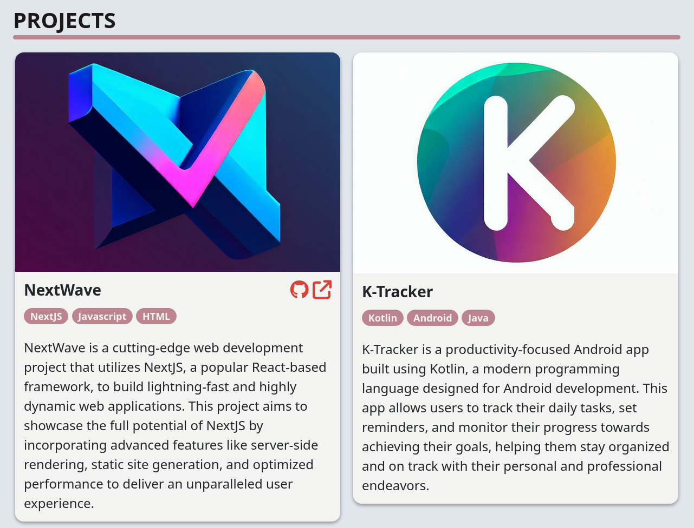

# Scaffolio

Scaffolio is a twig-base website generator that creates a beautiful, responsive portfolio website from a few JSON files.
You can assemble your personal portfolio website using any combination of the following sections:

* `about`: A general purpose intro/description section about you
* `skills`: A customizable table containing a list of categories (like Software) and a list of related skills
* `education`: A list of schools that you attended along with relevant info like degree, grad date, honors, etc.
* `experience`: A list of companies that you worked for and specific achievements from your time there
* `certifications`: A list of any relevant certifications you acquired
* `projects`: A list of any side projects you want to highlight

## Setup

This setup assumes you have `git`, `node`, and `npm` installed.

1. Clone this repo:
    ```bash
    git clone git@github.com:Zak-Bahm/scaffolio.git
    ```
2. Cd into the new repo:
    ```bash
    cd scaffolio
    ```
3. Install the necessary dependencies:
    ```bash
    npm ci
    ```
4. Using your editor of choice, edit the json files located in the `data` directory to include your info and customize the section order and website colors.
5. Build your portfolio website:
    ```bash
    npm run build
    ```
6. Start the local web server to check out your new website:
    ```bash
    npm run serve
    ```

When you have everything set up and you would like to deploy it, simply copy the contents of the `dist` folder onto your production webserver or to whichever service you would like to use such as s3.

## Sections
These examples are all of the available sections and the format of their JSON files.

### About


Here are the available options for the JSON file:

```json
{
    "text": ""
}
```

### Skills


Here are the available options for the JSON file:

```json
[
    {
        "header": "",
        "list": [""]
    }
]
```

### Education


Here are the available options for the JSON file:

```json
[
    {
        "school": "",
        "img": "",
        "degree": "",
        "field": "",
        "gradDate": "",
        "gpa": "",
        "honors": [""]
    }
]
```

### Experience


Here are the available options for the JSON file:

```json
[
    {
        "position": "",
        "dateRange": "",
        "img": "",
        "company": "",
        "slug": "",
        "location": "",
        "description": "",
        "specifics": [""],
        "badges": [""]
    }
]
```

### Certifications


Here are the available options for the JSON file:

```json
[
    {
        "name": "",
        "url": "",
        "img": "",
        "date": ""
    }
]
```

### Projects


Here are the available options for the JSON file:

```json
[
    {
        "name": "",
        "img": "",
        "url": "",
        "github": "",
        "badges": [""],
        "description": ""
    }
]
```
